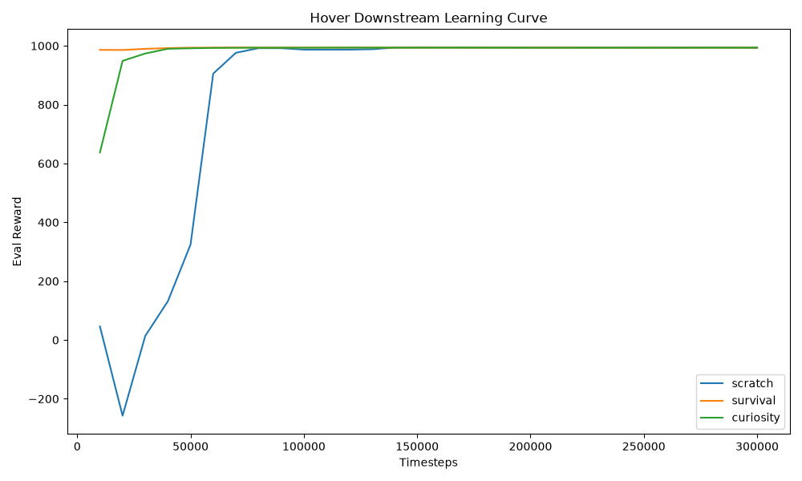

# Phase 5B: Curiosity Drone Control

| Agent                 |   CrashRate (Std) |   Stability (Std) |   Alt Error |   Angle Error |   Energy |   CrashRate (Perturb) |   Stability (Perturb) |
|:----------------------|------------------:|------------------:|------------:|--------------:|---------:|----------------------:|----------------------:|
| PPO_Scratch           |                 0 |                 1 |  0.0155554  |   0.000145166 |  255.261 |                  0.56 |                  0.44 |
| PPO_SurvivalPretrain  |                 0 |                 1 |  0.010413   |   1.26486e-06 |  256.53  |                  0.22 |                  0.78 |
| PPO_CuriosityPretrain |                 0 |                 1 |  0.00538292 |   1.95866e-06 |  253.702 |                  0.34 |                  0.66 |

