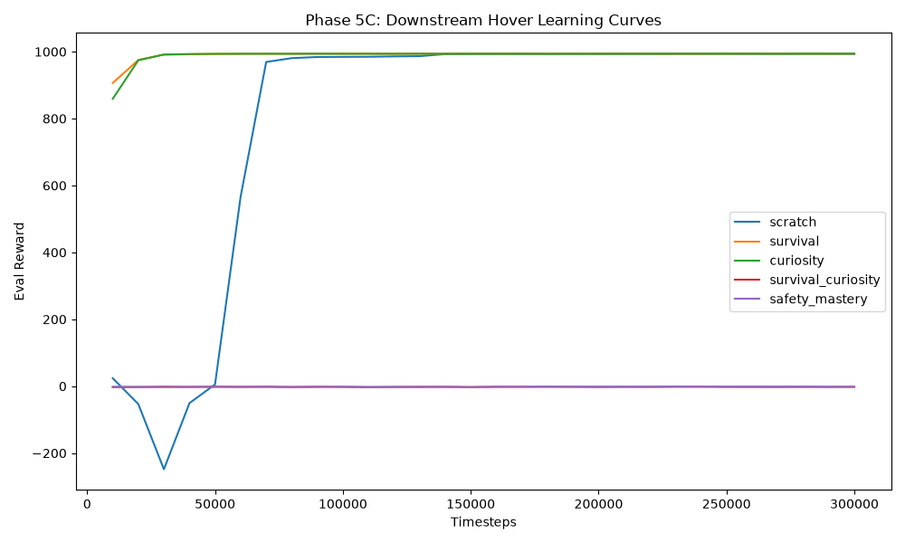
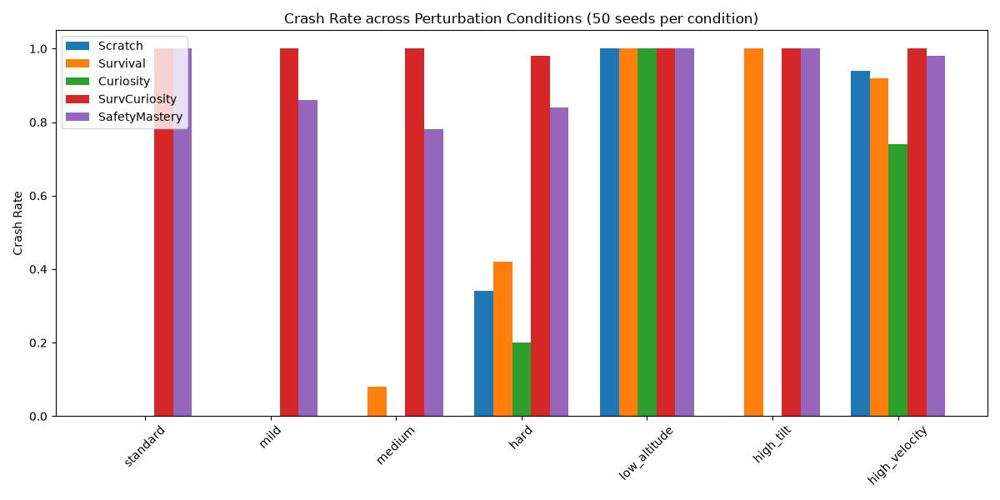

# Phase 5C: Safety-Gated Mastery Curiosity

## Evaluation Metrics (Preliminary: 50 seeds per condition)

### Crash Rates
| Agent         |   hard |   high_tilt |   high_velocity |   low_altitude |   medium |   mild |   standard |
|:--------------|-------:|------------:|----------------:|---------------:|---------:|-------:|-----------:|
| Curiosity     |   0.2  |           0 |            0.74 |              1 |     0    |   0    |          0 |
| SafetyMastery |   0.84 |           1 |            0.98 |              1 |     0.78 |   0.86 |          1 |
| Scratch       |   0.34 |           0 |            0.94 |              1 |     0    |   0    |          0 |
| SurvCuriosity |   0.98 |           1 |            1    |              1 |     1    |   1    |          1 |
| Survival      |   0.42 |           1 |            0.92 |              1 |     0.08 |   0    |          0 |

### Altitude Tracking Error (Lower is better)
| Agent         |       hard |    high_tilt |   high_velocity |   low_altitude |       medium |         mild |     standard |
|:--------------|-----------:|-------------:|----------------:|---------------:|-------------:|-------------:|-------------:|
| Curiosity     | 0.00621215 |   0.00621203 |      0.00620135 |            inf |   0.00621126 |   0.0062111  |   0.00621094 |
| SafetyMastery | 2.24919    | inf          |      3.03157    |            inf |   2.01657    |   1.76617    | inf          |
| Scratch       | 0.00599174 |   0.00597483 |      0.00594607 |            inf |   0.00600016 |   0.00599664 |   0.00599312 |
| SurvCuriosity | 0.585977   | inf          |    inf          |            inf | inf          | inf          | inf          |
| Survival      | 0.0135973  | inf          |      0.00892887 |            inf |   0.0130197  |   0.0117159  |   0.0111342  |

