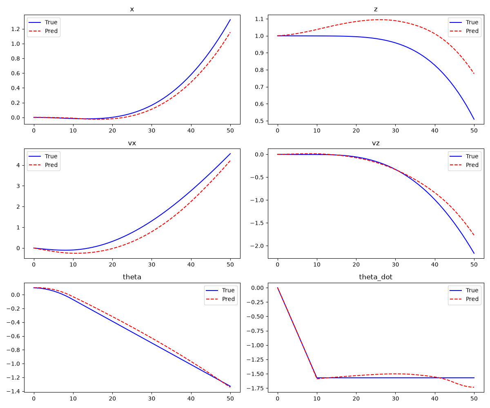

# Phase 5A: World Model Robustness Audit

## 1. Multi-Step Error Growth
Mean Squared Error over rollout horizons (for dimensions: x, z, vx, vz, theta, theta_dot):
| Horizon | x | z | vx | vz | theta | theta_dot |
|---|---|---|---|---|---|---|
| 5 steps | 0.000004 | 0.000033 | 0.001446 | 0.000039 | 0.000118 | 0.000012 |
| 10 steps | 0.000014 | 0.000299 | 0.007141 | 0.000158 | 0.000553 | 0.000019 |
| 25 steps | 0.000179 | 0.003667 | 0.056397 | 0.000187 | 0.002523 | 0.000576 |
| 50 steps | 0.005013 | 0.017716 | 0.149871 | 0.016152 | 0.002741 | 0.003075 |

## 2. Held-Out Action Regimes (1-Step MSE)
- **low_thrust**: 0.00004894
- **near_hover**: 0.00005986
- **high_thrust**: 0.00040517
- **asymmetric_thrust**: 0.00001723
- **recovery**: 0.00013868

## 3. Near-Boundary States (1-Step MSE)
- **low_altitude**: 0.00002381
- **high_tilt**: 0.00181517
- **high_velocity**: 0.00253340
- **high_angular_vel**: 0.00040113

## 4. Safety Prediction
- **ground_crash**: True Crash = True, Pred Crash = True (Match: True)
- **flip_crash**: True Crash = True, Pred Crash = True (Match: True)

